# 技术方案

- 使用 base62 作为短链接字符编码，也就是 `ABCDEFGHIJKLMNOPQRSTUVWXYZabcdefghijklmnopqrstuvwxyz0123456789`
- 基础位数设为 7 位，1 - 6 位作为自定义后缀的需求使用，可自动扩容为更高位 ID
- 允许更新链接地址、设置有效期，不过考虑到数据库冗余，设置有效期放到扩展服务以定时删除的功能项出现
- 为了满足数据分析的需求，使用一对多的关系
- 考虑到分布式的需求，使用发号器来解决号段分发问题
- 使用 Redis 集群作为后端数据库，MariaDB 作为数据备份
- 使用基于 TCP 协议的 RPC 调用
- 使用 JSON 作为数据交换格式，Protobuf 在数据很小的项目中压缩效果不明显，且吃 CPU
